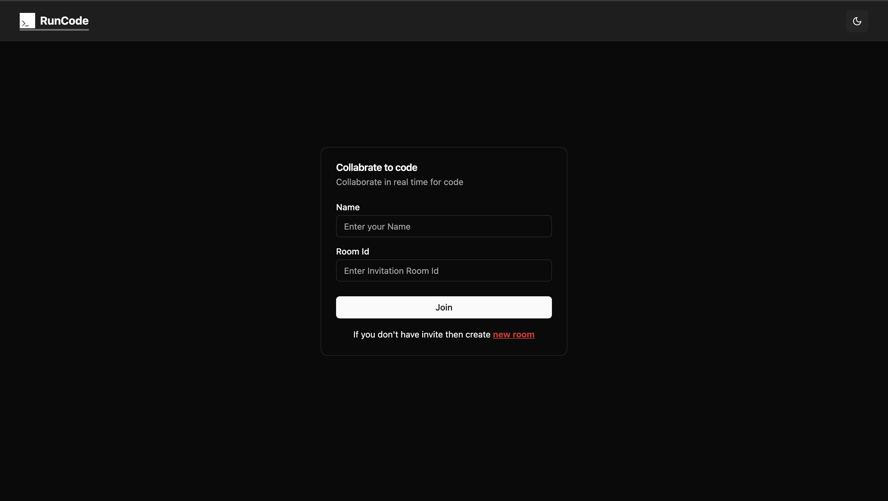
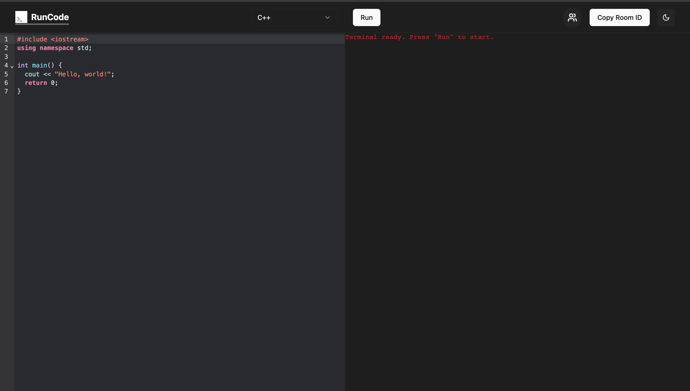
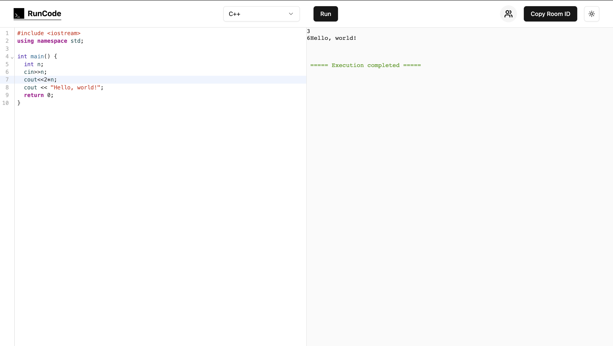

# RunCode

RunCode is an online code editor and compiler that enables real-time collaboration between two users in the same room. It allows both users to write, edit, and execute code simultaneously, with changes instantly reflected for both participants. The platform includes a built-in terminal to run code, making it an ideal tool for collaborative coding sessions.

## Features

- **Real-time Collaboration**: Allows two users to code together in real-time, with instant reflection of changes.
- **Integrated Terminal**: Includes a terminal for executing code within the editor.
- **Simultaneous Code Execution**: Both users can run their code at the same time, fostering collaboration.
- **User-Friendly Interface**: Clean and intuitive design for a seamless coding experience.
- **No Setup Required**: Accessible directly through the browser, with no installation needed.
- **Support for Multiple Languages**: Compatible with various programming languages for diverse coding needs.

## Installation

To install and run this project locally, follow these steps:

1. Clone the repository:

    ```bash
    git clone https://github.com/Shobhit2205/RunCode.git
    ```

2. Navigate to the folder:

    ```bash
    cd RunCode
    ```

### Backend Setup : You should have docker installed in your system

1. Install dependencies:

    ```bash
    cd server
    npm install
    ```

2. Start the backend server:

    ```bash
    npm run start
    ```

   ##### ******** OR ********

1. Run directly with docker:

    ```bash
    docker compose up
    ```

    The server should now be running on [http://localhost:8000](http://localhost:8000).

### Frontend Setup

1. starting frontend and Install dependencies:

    ```bash
    cd client
    npm install
    ```

3. Start the Frontend:

    ```bash
    npm run dev
    ```

    The client should now be running on [http://localhost:5173](http://localhost:5173).

## Usage

1. Open your browser and navigate to the frontend of your application.
2. Once connected, Enter your name and create a new room and join.
3. Now you can share the room ID with your friend to collaborate with you for code.

## Contributing

1. Fork the repository.
2. Create a new branch:

    ```bash
    git checkout -b feature/your-feature
    ```

3. Make your changes and commit them:

    ```bash
    git commit -m "Add a new feature"
    ```

4. Push your changes:

    ```bash
    git push origin feature/your-feature
    ```

5. Submit a pull request.


## Author

- [Shobhit Pandey](https://github.com/Shobhit2205) - [shobhitpandey2205@gmail.com](shobhitpandey2205@gmail.com)

## Screenshots







